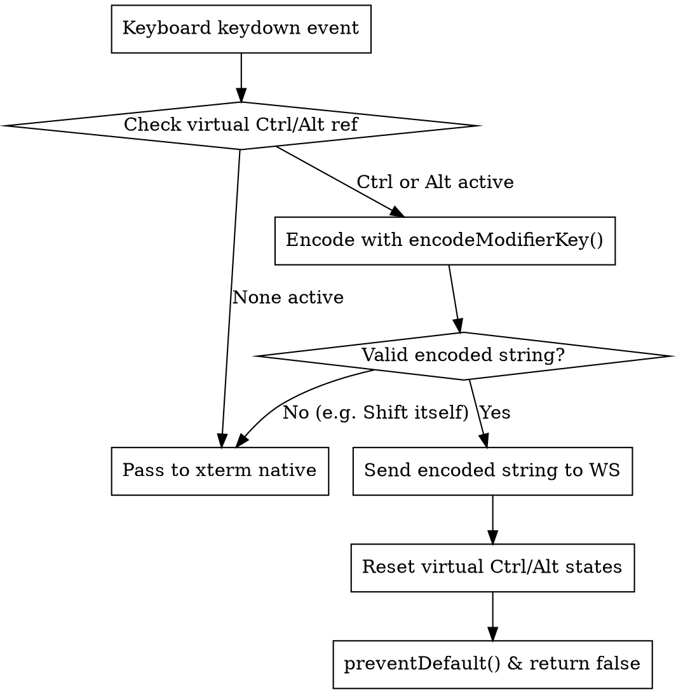

# 网页终端虚拟 CTRL / ALT 修饰键组合拦截与编码设计文档

## 1. 背景与目标 (Background & Objective)

在当前网页终端中，移动端辅助工具栏（`TerminalAccessoryBar`）提供了虚拟的 **CTRL** 和 **ALT** 状态切换按钮。但当用户点击激活这些修饰键后，在物理键盘或软键盘上按键时，`xterm.js` 并不能感知到网页上的虚拟修饰状态，导致无法组合触发快捷键（例如点击虚拟 CTRL 后按 `c` 依然输出普通字符 `'c'` 而不是终端中断信号 `^C` / `\x03`）。

**设计目标**：
1. 实现虚拟 CTRL / ALT 与键盘输入的无缝组合拦截与标准 VT100/ANSI 编码转义。
2. 触发组合输入后，虚拟修饰键自动单次消费并弹起恢复未激活状态。
3. 支持虚拟 CTRL 与虚拟 ALT 双修饰键叠加（如 CTRL+ALT+A $\to$ `\x1b\x01`）。

---

## 2. 架构与流程 (Architecture & Flow)

---

## 3. 按键编码规则 (Key Encoding Specification)

新建独立模块 `frontend/src/utils/terminalKeyEncoder.ts`，导出函数：
`encodeModifierKey(event: KeyboardEvent, ctrl: boolean, alt: boolean): string | null`

### 3.1 字母键 (`a-z` / `A-Z`)
- 当 `ctrl` 为 true 时：
  - 基础控制字符：`String.fromCharCode((char.toUpperCase().charCodeAt(0) - 64) & 0x1F)`
  - 例如：`a` $\to$ `\x01`, `c` $\to$ `\x03`, `d` $\to$ `\x04`, `z` $\to$ `\x1a`。
- 当 `ctrl` 为 false 时：
  - 基础字符为原始键值 `key`。
- 当 `alt` 为 true 时：
  - 在基础字符前添加 ESC 前缀（`\x1b` + 基础字符）。
  - 例如：`ALT + b` $\to$ `\x1bb`，`CTRL + ALT + c` $\to$ `\x1b\x03`。

### 3.2 特殊控制键与常用符号
- `CTRL + 2` / `CTRL + @` / `CTRL + Space` $\to$ `\x00` (NUL)
- `CTRL + 3` / `CTRL + [` $\to$ `\x1b` (ESC)
- `CTRL + 4` / `CTRL + \\` $\to$ `\x1c` (FS)
- `CTRL + 5` / `CTRL + ]` $\to$ `\x1d` (GS)
- `CTRL + 6` / `CTRL + ^` $\to$ `\x1e` (RS)
- `CTRL + 7` / `CTRL + _` / `CTRL + -` $\to$ `\x1f` (US)
- `CTRL + 8` / `CTRL + ?` / `CTRL + Backspace` $\to$ `\x7f` / `\x08`

### 3.3 方向键 (Arrow Keys)
- `Up`: 普通 `\x1b[A`，Ctrl `\x1b[1;5A`，Alt `\x1b[1;3A`，Ctrl+Alt `\x1b[1;7A`
- `Down`: 普通 `\x1b[B`，Ctrl `\x1b[1;5B`，Alt `\x1b[1;3B`，Ctrl+Alt `\x1b[1;7B`
- `Right`: 普通 `\x1b[C`，Ctrl `\x1b[1;5C`，Alt `\x1b[1;3C`，Ctrl+Alt `\x1b[1;7C`
- `Left`: 普通 `\x1b[D`，Ctrl `\x1b[1;5D`，Alt `\x1b[1;3D`，Ctrl+Alt `\x1b[1;7D`

### 3.4 纯修饰键过滤 (Modifier Keys Passthrough)
- 若按键本身为 `Shift`, `Control`, `Alt`, `Meta`, `CapsLock` 等，函数返回 `null`，不消费虚拟修饰键，等待后续有效字符键。

---

## 4. `WebTerminalView.tsx` 集成与联动

1. **State & Ref 双重维护**：
   - 维护 `isCtrlActive` (React state) 用于 UI 样式渲染；
   - 维护 `isCtrlActiveRef` (Ref) 供 `attachCustomKeyEventHandler` 闭包即时读取；
   - 对 `isAltActive` 与 `isAltActiveRef` 作相同处理。
2. **事件拦截器挂载**：
   - 在 `term` 初始化后调用 `term.attachCustomKeyEventHandler` 拦截 `keydown`。
   - 匹配成功后发送数据至 WebSocket，重置虚拟修饰键，阻止浏览器默认行为并向 xterm 返回 `false`。
3. **辅助栏联动**：
   - 用户点击辅助栏快捷动作（如 `^C`, `^D`, `^L`）时，同样重置虚拟修饰键。

---

## 5. 验证计划 (Verification Plan)

1. **单元测试**：针对 `terminalKeyEncoder.ts` 编写 Jest 单元测试，覆盖所有字母键、数字符号、方向键以及 CTRL+ALT 组合。
2. **构建测试**：运行 `npm run build:frontend` 和 `npm test`，确保无报错。
3. **交互验证**：
   - 点击虚拟 CTRL 按钮（高亮），敲击键盘字母 `c`，验证终端收到 `^C` 且 CTRL 按钮自动恢复未激活状态。
   - 点击虚拟 ALT 按钮（高亮），敲击字母 `b`，验证光标向左回退一个单词且 ALT 按钮自动恢复。
   - 同时点击虚拟 CTRL 与 ALT 按钮，敲击字母 `c`，验证发送 `\x1b\x03`。
