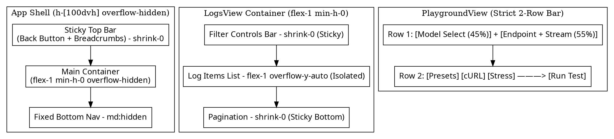

# 移动端吸顶标题固定、详情页返回栏常驻与 API 调试器紧凑 2 行布局设计规范

- **状态**: Approved
- **日期**: 2026-09-07
- **模块**: `frontend/src/App.tsx`, `frontend/src/components/LogsView.tsx`, `frontend/src/components/PlaygroundView.tsx`

---

## 1. 背景与核心诉求

### 1.1 现状缺陷
1. **移动端日志请求页面标题上滑消失**：移动端外层容器未锁定 `100dvh`，滚动发生在整个页面 body，导致顶栏及列表头部在上滑时被推出屏幕。
2. **所有详情页上方返回标题不固定**：点击进入某条日志或其他详情页后，顶栏返回按钮随长内容一起上移滚出视口，用户滑到底部后必须费力滑回顶层才能返回。
3. **API 调试器选择框占用行数过多**：移动端缺乏严格的行高约束，模型选择、端点输入、Stream 切换、预设、操作按钮等折行成 3~4 行，严重挤占编辑器面积。

### 1.2 优化目标
- **移动端 App 原生级外壳（Native Shell）**：整个应用在移动端锁定为 `100dvh` 不可滚动的外壳，顶栏 `<header>` 绝对常驻吸顶。
- **详情页返回按钮永远可见**：在详情页（如日志详情、各工具详情）中，顶部的返回按钮和标题常驻悬浮，支持随时一键返回。
- **列表与详情独立局部滚动**：`LogsView` 请求列表与右侧详情 Inspector 内部独立承载 `overflow-y-auto` 局部滚动，筛选栏与分页栏固定不移。
- **API 调试器移动端精准 2 行收敛**：第 1 行对半分摊“模型”与“端点+Stream”，第 2 行平铺“预设/辅助操作”与“发送按钮”，无论屏幕多窄绝不超出 2 行。

---

## 2. 总体架构与布局变更

---

## 3. 详细设计规范

### 3.1 移动端应用外壳与常驻顶栏 (`App.tsx`)
1. **根容器视口锁定**：
   - 移动端统一设为 `h-[100dvh] max-h-[100dvh] overflow-hidden`，防止整页 body 上下滑动。
2. **顶栏常驻吸顶**：
   - `<header>` 配置 `sticky top-0 z-40 shrink-0 bg-[var(--bg-surface)]/90 backdrop-blur-md`。
   - 详情激活时（`isMobileDetailActive` 为 true）：
     - 左侧高亮展示 `<ChevronLeft /> {返回上一级}` 按钮与当前条目缩略标题；
     - 即使内容向下滚动几万像素，顶栏始终稳固吸顶。
3. **内容区域尺寸约束**：
   - `<main>` 在移动端配置 `flex-1 min-h-0 overflow-hidden`，将滚动职责彻底委托给内部视图组件。

### 3.2 日志请求页面与详情页局部滚动 (`LogsView.tsx`)
1. **左侧列表栏结构**：
   - 外层保持 `flex flex-col min-h-0 h-full overflow-hidden`；
   - **固定头部 (shrink-0)**：日志标题 + 数量统计徽章 + 刷新按钮；
   - **固定过滤区 (shrink-0)**：日期与小时下拉、2xx/4xx/5xx 状态过滤 Pills、关键词搜索框；
   - **唯一滚动区 (flex-1 min-h-0 overflow-y-auto overscroll-contain)**：承载过滤后的日志条目；
   - **固定分页区 (shrink-0)**：页码指示与上一页/下一页按钮。
2. **右侧详情栏结构**：
   - **固定子 Tab 栏 (shrink-0)**：`Payload` / `Response` / `Chat` 切换胶囊与复制按钮；
   - **唯一滚动区 (flex-1 min-h-0 overflow-y-auto overscroll-contain)**：独立滚动 JSON 树与对话流。

### 3.3 API 调试器精准 2 行布局 (`PlaygroundView.tsx`)
1. **移动端（`lg:hidden`）2 行栅格化排版**：
   - **第 1 行（核心配置行，高度 34px）**：
     - 使用 `flex items-center gap-1.5 w-full`：
       - `[模型选择]`：`flex-[4] min-w-0 ui-card-sub py-1 px-2 text-xs truncate`；
       - `[端点选择与 Stream]`：`flex-[6] min-w-0 flex items-center ui-card-sub py-1 px-1.5`，内置极简 `[⚡ Stream]` 开关。
   - **第 2 行（工具与执行行，高度 34px）**：
     - 使用 `flex items-center justify-between w-full gap-1.5`：
       - 左侧：`[预设模板下拉]` + `[cURL 按钮]` + `[压测按钮]`；
       - 右侧：`[运行测试 (Run Test) 主按钮]`。
2. **桌面端（`lg:flex`）**：
   - 维持单行自适应流线型排版，左右功能模块清晰对齐。

---

## 4. 验证与回归测试规划

1. **测试用例 (`tests/mobileStickyHeadersAndLayout.test.ts`)**：
   - 验证 `App.tsx` 根容器与 `<header>` 在移动端包含 `h-[100dvh]`、`overflow-hidden`、`sticky top-0` 与 `shrink-0`；
   - 验证 `LogsView.tsx` 左侧列表区分出独立的 `overflow-y-auto` 区域，且过滤器与分页栏使用 `shrink-0`；
   - 验证 `PlaygroundView.tsx` 包含专门为移动端收缩的 2 行排版结构；
2. **移动端实际视口测试**：
   - 使用 375px/390px 视口断点测试长列表上滑与详情页长文本滚动，确认顶栏与返回按钮 100% 常驻；
3. **全量构建验证**：
   - 运行 `npm run build`，确保 TypeScript 检查与打包零警告、零报错。
