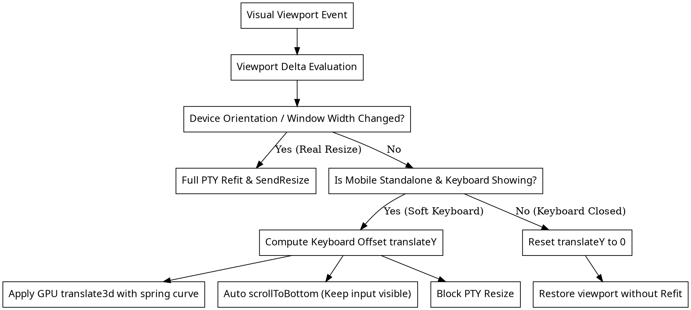

# WebTerminal 移动端全屏键盘弹起平滑上推设计规范

- **状态**: Approved
- **日期**: 2026-09-07
- **模块**: `frontend/src/components/WebTerminalView.tsx` & 相关移动端视口处理

---

## 1. 背景与目标

### 1.1 现状与问题
当前 WebTerminal 在移动端全屏模式（Standalone 模式）下，每次移动端拉起或收起软键盘时：
1. `window.visualViewport` 频繁派发 `resize` 与 `scroll` 事件；
2. 现有逻辑直接将终端容器高度动态设置为 `visualViewport.height`，并频繁调用 `fitAddon.fit()` 和 `sendResize(cols, rows)`；
3. 导致每次键盘弹起/收起都会向后端 PTY 发送行列调整信号，不仅引起终端内运行程序（如 Vim, Htop, 常用命令等）剧烈重绘与画面闪烁，而且经常造成字符排版错乱和界面被压扁；
4. 交互体验欠佳，缺乏类似原生微信、Telegram 等聊天软件在软键盘弹起时“内容整体平滑向上推移，键盘收起时平滑滑落”的平稳动效。

### 1.2 优化目标
- **零 PTY 重绘扰动**：移动端拉起/收起软键盘时，**绝对不触发** XTerm `fitAddon.fit()` 和后端 PTY `sendResize`；终端内部行列数（cols/rows）在打字输入期间保持完全静止。
- **平滑推顶（仿微信聊天交互）**：键盘弹起时，利用 GPU 硬件加速的 `translate3d(0, -keyboardHeight, 0)` 将整个终端视图平滑上推，让输入焦点与 AccessoryBar 贴合在键盘上方；键盘收起时顺滑复位。
- **手势与旋转自适应**：
  - 键盘处于激活状态时，用户在终端内容区向下滑动或点击终端历史内容可自动收起键盘恢复全屏视口；
  - 发生物理屏幕旋转（横竖屏切换）或进出 Standalone 模式时，自动刷新尺寸基准并触发合法的 PTY Resize。

---

## 2. 总体架构与数据流



---

## 3. 详细方案设计

### 3.1 视口锁定与 PTY Resize 隔离策略
1. **全屏基准高度（Base Height）**：
   - 记录进入 Standalone 时的基准高度 `baseHeightRef.current = window.innerHeight`。
   - 记录基准宽度 `baseWidthRef.current = window.innerWidth`。
   - 在 Standalone 模式下，外层容器的高度固定为 `baseHeightRef.current` 或 `100dvh`，不再将其设为 `vv.height`。
2. **PTY Resize 阻断判定**：
   - 仅当满足以下任一条件时才调用 `fitAddon.fit()` 与 `sendResize`：
     - `Math.abs(window.innerWidth - baseWidthRef.current) > 20`（发生了横竖屏旋转或桌面窗体拉伸）；
     - Standalone 全屏模式开关状态切换；
     - 显式字体缩放（Zoom In / Zoom Out）。
   - 如果宽度未变且仅高度变小（键盘弹起特征：高度减少 > 150px 或 > 基准高度的 18%），则判定为软键盘弹起，**坚决阻断** `sendResize`。

### 3.2 键盘高度感知与 CSS 硬件加速推顶算法
1. **键盘偏移量计算**：
   ```ts
   const rawDiff = baseHeightRef.current - vv.height;
   const isKeyboardShowing = rawDiff > Math.min(150, baseHeightRef.current * 0.18);
   const translateY = isKeyboardShowing ? Math.max(0, rawDiff - vv.offsetTop) : 0;
   ```
2. **样式动效渲染**：
   - 全屏容器使用 CSS Transform：
     ```ts
     const dynamicStyle: React.CSSProperties = isMobile && standalone ? {
       height: `${baseHeightRef.current}px`,
       maxHeight: `${baseHeightRef.current}px`,
       transform: `translate3d(0, -${translateY}px, 0)`,
       transition: 'transform 0.22s cubic-bezier(0.16, 1, 0.3, 1)',
       willChange: 'transform',
     } : {};
     ```
   - 避免直接操作 `top` / `height` 引起的页面重排抖动。
3. **输入焦点自动滚动**：
   - 当 `isKeyboardShowing` 变为 true 时，调用 `term.scrollToBottom()`，保证正在输入的终端提示符及 AccessoryBar 紧贴软键盘上沿。

### 3.3 交互细节与手势体验优化
1. **下滑收起键盘（微信式自然交互）**：
   - 当键盘弹起中，用户单指在终端区域向下滑动（或点击 AccessoryBar 收起键盘按钮），自动触发当前获得焦点的 `textarea` 执行 `blur()`；
   - 随之键盘收起，`translateY` 平滑恢复为 0，终端完整全屏展现。
2. **屏幕旋转恢复**：
   - 监听 `resize` / `orientationchange` 事件。当检测到 `window.innerWidth` 发生实质改变时：
     1. 让激活的输入框失焦收回键盘，重置 `translateY = 0`；
     2. 更新 `baseWidthRef.current = window.innerWidth` 与 `baseHeightRef.current = window.innerHeight`；
     3. 延迟 100ms（等待旋转就绪后）执行一次标准 `fitAddon.fit()` 与 `sendResize`。

---

## 4. 影响与边界

- **受影响组件**:
  - `frontend/src/components/WebTerminalView.tsx`（更新视口监听、样式计算、手势下滑处理与 resize 拦截逻辑）
  - `frontend/src/components/terminal/TerminalAccessoryBar.tsx`（保持与终端底部贴合与协同动作）
- **不受影响组件**:
  - 后端 WebSocket 协议与 PTY 交互无需任何破坏性变更。
  - 桌面端尺寸适应及普通模式保持完全兼容。

---

## 5. 验证标准与测试用例

1. **零 PTY 重绘测试**：在移动端打开 WebTerminal 全屏模式，运行 `top` 或在 bash 中输入长字符串，点击唤起软键盘与关闭软键盘多次，终端内行字符无重排、无截断、无闪烁重绘。
2. **推顶与滑落动画测试**：键盘拉起时 AccessoryBar 与终端底部输入光标平稳被顶在软键盘上方；键盘关闭时顺畅回落。
3. **旋转测试**：在全屏模式下旋转屏幕，终端能够在新屏幕方向下正确排版并重新适配行列。
4. **编译与构建验证**：运行 `npm run build:frontend` 确保无 TypeScript 与 Vite 编译报错。
