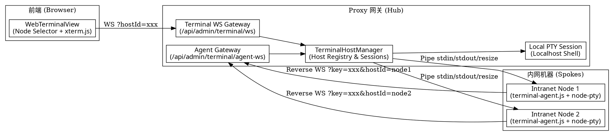

# WebTerminal 多机器内网纳管与反向 Agent 桥接设计规范

- **状态**: Approved
- **日期**: 2026-09-07
- **模块**: `src/admin/services/terminalHostManager.ts`, `src/admin/routes/terminalWs.ts`, `scripts/terminal-agent.js`, `frontend/src/components/WebTerminalView.tsx`

---

## 1. 背景与业务价值

当前系统的 WebTerminal 采用单实例本地直连架构：
- 服务端通过 `node-pty` 直接在 Proxy 部署的宿主机上 `spawn` 本地 shell；
- 前端只能够连接并操作当前的这一台机器，无法实现多机器集中式运维；
- 在实际内网生产/集群环境中，运维人员通常有多台不同用途的机器（应用服务器、数据库、开发机、GPU 节点等），这些机器往往处于私有内网子网中，没有公网 IP，也未对外开放标准 SSH 22 端口。

**设计目标**：
1. **天然穿透内网 NAT/防火墙**：内网各机器运行轻量 Node.js Agent 客户端，主动向 Proxy 网关反向建立 WebSocket 长连接注册，无需配置端口映射或公网 IP。
2. **多机器统一资产管理**：Proxy 服务端提供 `TerminalHostManager` 集中管理所有注册主机，包括“本地服务器 (localhost)”与多台“远程 Agent 机器”，维护在线状态、心跳检测与会话隔离。
3. **前端快速切换**：在 Web 终端顶部提供“节点选择器（Node Selector）”下拉菜单，支持在多机器之间无缝切换；每个机器的会话独立保持运行，切换回来历史不丢失。
4. **同构轻量、开箱即用**：Agent 为免复杂安装的纯 Node.js 单文件脚本，提供开箱即用的一键连接命令与断线自愈能力。

---

## 2. 总体架构图



---

## 3. 详细设计规范

### 3.1 双向 WebSocket 协议设计

#### 端点 A: Web 前端接入 (`WS /api/admin/terminal/ws`)
- **Query 参数**:
  - `x-admin-key`: 管理鉴权凭据；
  - `hostId`: 目标机器 ID（默认 `'local'` 代表网关宿主机；其他如 `'node-db-01'` 代表指定 Agent 机器）。
- **数据流**:
  - 客户端发送：按键原始字符，或者 `JSON:{"type":"resize","cols":80,"rows":24}`、`JSON:{"type":"reset"}`；
  - 服务端返回：对应机器 PTY 的实时输出字符流或回放 buffer。

#### 端点 B: Agent 客户端反向注册 (`WS /api/admin/terminal/agent-ws`)
- **Query 参数**:
  - `key`: `ADMIN_SECRET_KEY` 鉴权密码；
  - `hostId`: Agent 唯一机器标识；
  - `name`: 节点人性化名称（如 “生产数据库”）；
  - `hostname`: 系统主机名；
  - `platform`: `linux` | `darwin` | `win32`；
  - `ip`: 内网首选 IPv4 地址。
- **控制帧与数据帧交互**:
  - `Agent → Hub`: 
    - 原始字符输出（PTY output）；
    - `JSON:{"type":"status","event":"exit","code":0}`（shell 进程退出通知）；
    - `JSON:{"type":"pong"}`（心跳响应）。
  - `Hub → Agent`:
    - 原始用户按键流；
    - `JSON:{"type":"resize","cols":...,"rows":...}`（窗口适应）；
    - `JSON:{"type":"reset"}`（重启 shell）；
    - `JSON:{"type":"ping"}`（15秒周期的 Hub 心跳保活探测）。

### 3.2 服务端 `TerminalHostManager` 设计

- **统一终端会话接口 (`ITerminalSession`)**:
  ```ts
  export interface ITerminalSession {
    attach(ws: any): void;
    detach(ws: any): void;
    write(data: string): void;
    resize(cols: number, rows: number): void;
    reset(): void;
    destroy(): void;
  }
  ```
- **会话实现**:
  - `LocalTerminalSession`: 现有的单例/多例本地 `node-pty` 会话；
  - `RemoteAgentTerminalSession`: 持有对应 Agent 客户端 WebSocket 连接，维护 1MB 历史输出环形缓冲区（Ring Buffer），将 Web 前端的读写请求透传转发给 Agent，并负责在前端重新连接时做输出快照重放（Replay）。
- **主机清单 REST API (`GET /api/admin/terminal/hosts`)**:
  - 返回受保护的当前在线与已知主机列表，包括 ID、名称、IP、操作系统、在线状态与延迟。

### 3.3 轻量 Node.js Agent 实现 (`scripts/terminal-agent.js`)

- **功能特性**:
  - 单文件开箱即用，支持参数配置：`--server`, `--key`, `--name`, `--id`, `--shell`；
  - 自动发现本机的内网 IP 与操作系统信息；
  - 使用 `node-pty` 创建本地伪终端进程；
  - 断线指数退避重连（2s, 4s, 8s ... 最大 30s），保障服务端或网络波动恢复后自动重连；
  - 提供 `npm run terminal-agent` 启动快捷脚本。

### 3.4 前端界面设计 (`WebTerminalView.tsx`)

- **顶部节点选择器（Node Selector）**:
  - 放置于顶部窗口控制栏左侧/中间，展示当前机器图标、名称与在线状态灯；
  - 点击弹出下拉框，显示所有在线/离线主机，支持按机器名或内网 IP 实时过滤；
  - 提供 “接入新节点” 指南弹窗，展示预生成的一键加入命令；
- **状态切换与记忆**:
  - 切换节点时平滑断开当前会话并接入新目标会话，恢复历史终端数据；
  - 选用 `localStorage.setItem('terminal_active_host', hostId)` 持久化用户当前选中的节点。

---

## 4. 验证标准与测试规划

1. **单元测试 (`terminalHostManager.test.ts`)**:
   - 验证主机注册、反向接入、离线心跳超时清理、多会话独立隔离；
   - 验证消息帧透传与 `resize` 信号传递。
2. **REST API 测试 (`terminalHostsApi.test.ts`)**:
   - 验证 `GET /api/admin/terminal/hosts` 在鉴权通过/不通过时的行为及返回数据格式。
3. **Agent 客户端仿真测试 (`terminalAgent.test.ts`)**:
   - 模拟 Agent 启动与 Hub 进行握手、字符读写与断线重连逻辑。
4. **前端组件测试**:
   - 验证 Node Selector 下拉菜单、主机列表渲染与切换回调。
5. **完整构建验证**:
   - 运行 `npm run build`，确保前后端 100% 编译通过。
