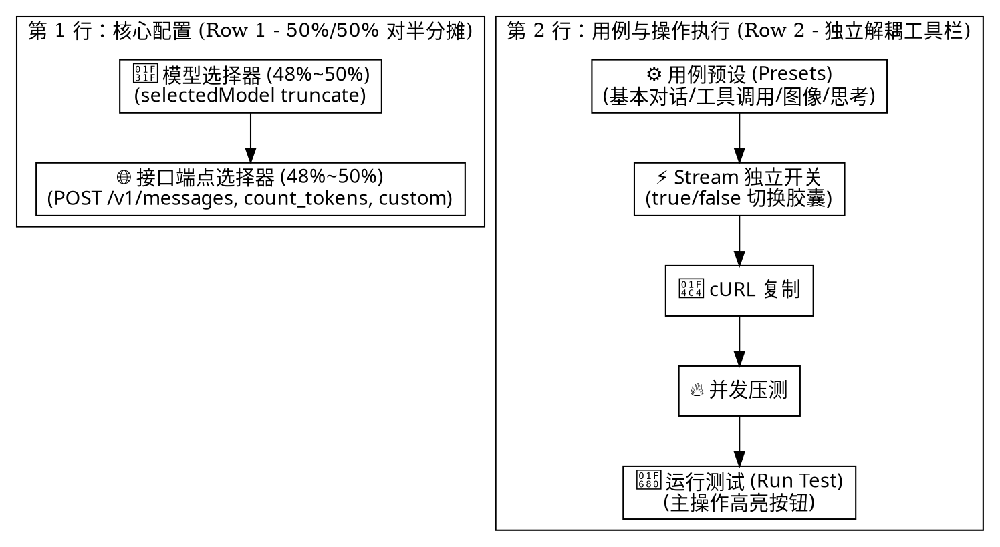

# API 调试器控制条解耦与移动端紧凑 2 行布局设计规范

- **状态**: Approved
- **日期**: 2026-09-07
- **模块**: `frontend/src/components/PlaygroundView.tsx`

---

## 1. 背景与核心问题

### 1.1 现状缺陷
在当前 `PlaygroundView.tsx` 顶部的控制条中存在控件重叠与排版拥挤的问题：
- **流式开关（Stream）被错误内嵌**：此前流式开关按钮（`Stream Toggle`）被硬塞在“接口端点选择”这个 `ui-card-sub` 胶囊的内部末尾；
- **与用例预设（Presets）产生视觉粘连与重叠**：紧跟其后放置了用例预设（Presets）下拉选择框，在移动端与中等屏幕（1024px 左右）下，内嵌的 Stream 按钮与右侧/下方的 Presets 选择框发生距离挤压、甚至重叠错位；
- **接口端点文字被过度挤压**：因为 Stream 按钮吃掉了端点胶囊近 35% 的宽度，导致 `POST /v1/messages` 等选项文字严重被截断看不清。

### 1.2 优化目标
- **完全解耦控件层级**：将流式开关（Stream Toggle）彻底从接口端点（Endpoint）内部移出，作为独立的按键胶囊放入操作工具组中。
- **严谨的 2 行网格排布（移动端）**：
  - **第 1 行（核心目标与接口）**：模型选择（50%）与接口端点选择（50%）对半平分，两边宽度充裕、文字清晰；
  - **第 2 行（用例配置与操作执行）**：用例预设（Presets）下拉框 + 独立的 `[⚡ Stream]` 切换胶囊 + `[cURL]` 复制 + `[压测]` + `[运行测试]` 主按钮。
- **桌面端流线型单行平铺**：在大屏下自然对齐为一整行现代化开发工作台。

---

## 2. 结构重构对比图

---

## 3. 详细排版规范

### 3.1 移动端（`< 1024px`）精准 2 行布局
1. **第 1 行（高度 34px）**：
   - 容器：`flex items-center gap-1.5 sm:gap-2 w-full flex-1`；
   - `[模型选择]`：`ui-card-sub px-2.5 py-1.5 flex-1 min-w-0`，内置 `Sparkles` 图标与模型下拉；
   - `[接口端点]`：`ui-card-sub px-2.5 py-1.5 flex-1 min-w-0`，内置 `Globe` 图标与端点下拉（若选 custom 则展开方法与路径输入框）。
2. **第 2 行（高度 34px）**：
   - 容器：`flex items-center justify-between gap-1.5 w-full shrink-0`；
   - 左侧工具流：
     - `[用例预设 (Presets)]`：独立下拉框（`pr-6 py-1 px-2 text-xs font-medium`）；
     - `[流式开关 (Stream Toggle)]`：独立的 pill 按钮，包含 `Zap` 图标与状态指示，点击在 body 中切换 `stream: true/false`；
     - `[cURL 复制]`：紧凑快捷图标按键；
     - `[并发压测]`：紧凑图标按键；
   - 右侧常驻：
     - `[运行测试 (Run Test)]`：`ui-btn-primary px-3.5 py-1.5`，发送按钮。

### 3.2 桌面端（`≥ 1024px`）单行流线型
- `flex flex-row items-center justify-between`：
  - 左侧：`[模型选择]` + `[接口端点]`；
  - 右侧：`[用例预设]` + `[Stream 开关]` + `[cURL]` + `[并发压测]` + `[系统密钥标签]` + `[运行测试]`。

---

## 4. 验证标准

1. **测试断言 (`tests/playgroundLayoutDecoupling.test.ts`)**：
   - 验证 `PlaygroundView.tsx` 中 `Stream Toggle` 按钮脱离了 `endpointOption` 所在的胶囊容器，成为独立的兄弟控制项；
   - 验证第 1 行由 `selectedModel` 与 `endpointOption` 各自平分 `flex-1`；
   - 验证第 2 行中 `activePreset` 下拉框与 `handleToggleStreamInBody` 独立排布，无重叠或多余嵌套。
2. **全量构建验证**：
   - 运行 `npm test` 保证所有测试套件通过；
   - 运行 `npm run build:frontend` 保证 Vite 生产打包零错误。
