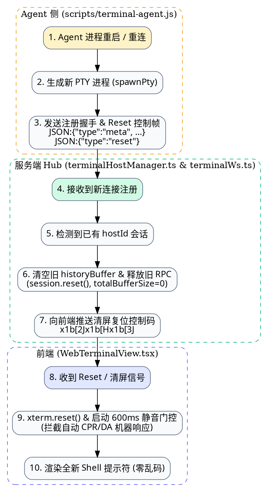

# 内网终端服务重启重连乱码死循环修复规范

- **状态**: Approved
- **日期**: 2026-09-08
- **模块**: `src/admin/services/terminalHostManager.ts`, `src/admin/routes/terminalWs.ts`, `scripts/terminal-agent.js`, `frontend/src/components/WebTerminalView.tsx`, `frontend/src/utils/terminalFilter.ts`

---

## 1. 缺陷背景与根因

### 1.1 缺陷现象
当内网终端服务（`terminal-agent.js` 或服务端终端会话）发生重启、断线重新连接后，若用户没有手动刷新浏览器页面，终端界面会突然陷入失控状态，疯狂并持续不断地输出形如 `^[[24;80R`、`^[[>0;276;0c`、`^[[1;2c`、`^]]11;rgb:...` 的 ANSI 乱码字符串，无法正常输入命令。

### 1.2 根因定位 (Root Cause)
1. **历史缓冲区残留 (Buffer Stale)**：
   Agent 重启重新连入服务端时，服务端 `TerminalHostManager` 识别到相同 `hostId`，复用了原有的 `RemoteAgentTerminalSession`，但没有清空旧会话累积的 `historyBuffer`；
2. **xterm.js 自动生成机器报告 (Synthetic Device Reports)**：
   旧历史中包含诸如 `\x1b[6n`（光标查询）、`\x1b[>c`（设备属性查询）、`\x1b]11;?`（背景色查询）等控制码。前端 xterm.js 接收到这些历史字符后，会根据终端规范自动触发 `onData` 发送机器应答（如 CPR `\x1b[24;80R`、DA `\x1b[>0;276;0c` 等）；
3. **回显正反馈自激回环 (Echo Self-Oscillation Loop)**：
   新生成的 PTY 刚启动正在初始化，收到了前端发来的这批机器应答，Shell 无法识别，将其视为用户键盘敲击并回显（Echo）到终端输出；xterm 再次接收并再次响应，服务端又将它们追加到历史缓冲区中，形成了“应答 -> 回显 -> 再应答 -> 再回显”的持续雪崩式死循环。

---

## 2. 修复架构设计

---

## 3. 详细修复策略

### 3.1 Agent 侧（`scripts/terminal-agent.js`）
1. 在 WebSocket 连接成功（`ws.on('open')`）且生成新 PTY 进程后，向服务端主动发送 `JSON:{"type":"reset"}`，明确通知服务端重置历史；
2. 当由于网络中断或异常退出重新执行 `spawnPty()` 时，重置本地状态。

### 3.2 服务端 Hub（`terminalHostManager.ts` 与 `terminalWs.ts`）
1. 在 `TerminalHostManager.registerAgent()` 收到重连注册时：
   - 自动调用 `session.reset()` 清空旧的 `historyBuffer` 和计数器；
   - 自动清空并拒绝未完成的旧 `rpcResolvers`；
   - 主动向所有连接着该 host 的前端客户端下发 `JSON:{"type":"reset"}` 及 ANSI 复位序列 `\x1b[2J\x1b[H\x1b[3J`；
2. 服务端在收到 Agent 广播的重置信令时，协同分发到 Web 客户端。

### 3.3 前端终端（`WebTerminalView.tsx` 与 `terminalFilter.ts`）
1. **静音门控升级**：
   - 每次 WebSocket `onopen` 或收到 `JSON:{"type":"reset"}` 时，开启强力静音门控（`isReplayingRef.current = true`，初始 600ms 窗口）；
   - 在静音门控开启期间，持续通过 `isSyntheticTerminalReport()` 拦截并丢弃所有机器应答序列，严禁将机器应答发送给后端 WebSocket；
2. **过滤规则增强（`isSyntheticTerminalReport`）**：
   - 覆盖所有 CPR 光标位置报告（`\x1b[\d+;\d+R`、`\x1b[\d+;\d+;\d+R`）；
   - 覆盖所有 DA / DA2 / DA3 设备属性报告（`\x1b[>...c`、`\x1b[?...c`、`\x1b[=...c`）；
   - 覆盖所有 OSC 10/11 颜色查询响应及 DEC 状态报告（`\x1b[...$y`）；
3. **尺寸重新校准**：
   - 重置后触发 `fitAddon.fit()` 并向后端发送准确的 `resize` 命令，使 PTY 与浏览器视口尺寸立即达成一致。

---

## 4. 自动化测试与验证

1. **测试断言 (`tests/terminalReplayMute.test.ts` & `tests/terminalAgentReconnectReset.test.ts`)**：
   - 验证 Agent 重启后 `registerAgent` 能够成功重置 `historyBuffer` 为 0；
   - 验证重置后向客户端广播 `reset` 控制消息；
   - 验证 `isSyntheticTerminalReport` 能够精准识别并拦截各类复合设备应答序列，且绝不误杀用户手动敲击的字符。
2. **全量构建验证**：
   - `npm test` 保证全套测试通过；
   - `npm run build` 保证前后端编译零错误。
