# Web 终端多主机文件管理功能设计规范

- **状态**: Approved
- **日期**: 2026-09-08
- **模块**: `src/admin/services/terminalFileService.ts`, `src/admin/routes/adminRoutes.ts`, `scripts/terminal-agent.js`, `frontend/src/components/terminal/TerminalFileManagerView.tsx`, `frontend/src/components/UnifiedTerminalView.tsx`

---

## 1. 背景与目标

### 1.1 背景
Gemini Proxy 现已支持基于 PTY 的本地 Web 终端与基于反向 Agent 通道的远程内网多主机终端（`TerminalHostManager`）。在实际运维与开发排查过程中，除了命令行交互，快速浏览目录结构、查看编辑日志与配置文件、上传部署包或下载运行成果是极高频的诉求。

### 1.2 核心目标
1. **统一多主机支持**：不仅支持 Localhost 本地服务器文件系统，而且与当前终端选中的 Agent 远程主机天然联动，实现“选哪个主机就管哪台机器的文件”；
2. **全功能轻量运维**：
   - **浏览**：逐级面包屑导航、绝对路径输入直达、可向上回溯上级目录；
   - **预览与编辑**：智能识别文本/代码/配置文件（支持语法高亮与在浏览器内编辑保存），图片自适应预览；
   - **传输**：原生浏览器下载流式保存、拖拽或按钮上传文件；
   - **管理**：新建目录、重命名、递归删除。
3. **终端无缝集成**：在终端顶部提供 `[ 命令行终端 ] | [ 📁 文件管理 ]` 双子标签，与 Host 选择器一体化协同。

---

## 2. 总体架构与数据流

```dot
digraph Architecture {
    rankdir=LR;
    node [shape=box, fontname="sans-serif", style="rounded,filled", fillcolor="#f8fafc", color="#64748b"];

    subgraph cluster_frontend {
        label = "前端 (React / Tailwind / Lucide)";
        style = "rounded,dashed";
        color = "#6366f1";
        UI [label="终端统一容器\n(UnifiedTerminalView)", fillcolor="#e0e7ff"];
        SubTabs [label="子标签切换\n[命令行终端 | 文件管理]"];
        FileView [label="文件管理器组件\n(TerminalFileManagerView)"];
        UI -> SubTabs;
        SubTabs -> FileView;
    }

    subgraph cluster_backend {
        label = "后端 (Express API & Terminal Hub)";
        style = "rounded,dashed";
        color = "#10b981";
        FileAPI [label="统一文件接口\n(/api/admin/terminal/files/*)", fillcolor="#d1fae5"];
        FileService [label="文件路由与调度服务\n(TerminalFileService)"];
        LocalFS [label="本地文件驱动 (LocalFS)"];
        AgentTunnel [label="Agent 反向隧道 RPC 网关\n(TerminalHostManager)"];
        
        FileAPI -> FileService;
        FileService -> LocalFS [label="hostId == 'local'"];
        FileService -> AgentTunnel [label="hostId != 'local'"];
    }

    subgraph cluster_agent {
        label = "远程内网节点 (Remote Agent)";
        style = "rounded,dashed";
        color = "#f59e0b";
        AgentHandler [label="scripts/terminal-agent.js\n(文件指令处理模块)", fillcolor="#fef3c7"];
        AgentFS [label="远程操作系统文件系统 (fs)"];

        AgentHandler -> AgentFS;
    }

    FileView -> FileAPI [label="HTTP REST / Upload / Download\n(带 x-admin-key & hostId)"];
    AgentTunnel -> AgentHandler [label="WebSocket RPC\nJSON:{type:'file_rpc', ...}"];
}
```



---

## 3. 后端 REST API 与 Agent RPC 协议

### 3.1 REST API 规范（受 `adminAuthMiddleware` 保护）

1. **`GET /api/admin/terminal/files/list`**
   - Query: `hostId: string`, `path?: string`
   - Response:
     ```json
     {
       "success": true,
       "currentPath": "/Users/yogo/Projects/gemini-proxy",
       "parentPath": "/Users/yogo/Projects",
       "separator": "/",
       "files": [
         {
           "name": "package.json",
           "path": "/Users/yogo/Projects/gemini-proxy/package.json",
           "isDirectory": false,
           "size": 2450,
           "updatedAt": 1725780000000,
           "extension": "json"
         }
       ]
     }
     ```

2. **`GET /api/admin/terminal/files/content`**
   - Query: `hostId: string`, `path: string`
   - Response:
     ```json
     {
       "success": true,
       "path": "/Users/yogo/Projects/gemini-proxy/package.json",
       "content": "{ ... }",
       "size": 2450,
       "isBinary": false
     }
     ```

3. **`POST /api/admin/terminal/files/save`**
   - Body: `{ "hostId": "...", "path": "...", "content": "..." }`
   - Response: `{ "success": true }`

4. **`GET /api/admin/terminal/files/download`**
   - Query: `hostId: string`, `path: string`
   - Headers: `Content-Disposition: attachment; filename="..."`
   - Response: 文件二进制流（Local 直接管道流式传输，Agent 经由分块聚合后管道返回）。

5. **`POST /api/admin/terminal/files/upload`**
   - Query: `hostId: string`, `path: string`
   - Body: `multipart/form-data`（包含单个或多个文件）
   - Response: `{ "success": true, "uploaded": ["filename"] }`

6. **`POST /api/admin/terminal/files/mkdir`**
   - Body: `{ "hostId": "...", "path": "...", "dirName": "..." }`
   - Response: `{ "success": true }`

7. **`POST /api/admin/terminal/files/rename`**
   - Body: `{ "hostId": "...", "oldPath": "...", "newPath": "..." }`
   - Response: `{ "success": true }`

8. **`DELETE /api/admin/terminal/files/delete`**
   - Query: `hostId: string`, `path: string`
   - Response: `{ "success": true }`

---

### 3.2 Agent WebSocket RPC 协议

所有文件 RPC 请求与响应均使用 `JSON:` 前缀作为控制信令，不污染 PTY 字符流：

```typescript
// 发送给 Agent 的信令
interface AgentFileRpcRequest {
  type: 'file_rpc';
  reqId: string;
  action: 'list' | 'read' | 'write' | 'delete' | 'mkdir' | 'rename' | 'upload_chunk' | 'download_chunk';
  path: string;
  params?: any;
}

// Agent 的回包信令
interface AgentFileRpcResponse {
  type: 'file_rpc_res';
  reqId: string;
  success: boolean;
  data?: any;
  error?: string;
}
```

---

## 4. 前端组件与交互设计

1. **`UnifiedTerminalView.tsx`**：
   - 托管公共状态：`subTab` (`'interactive' | 'files'`) 与 `activeHostId`；
   - 顶部提供统一控制栏，平滑切换 PTY 终端与文件管理器。
2. **`TerminalFileManagerView.tsx`**：
   - **路径与面包屑**：可逐级点击返回上层，支持一键复制路径或切换为输入框直接跳转；
   - **文件列表**：支持按文件名、大小、修改时间排序；
   - **操作栏**：包含刷新、新建文件夹、上传文件（支持拖拽上传）；
   - **行内快捷操作**：预览/编辑、下载、重命名、删除（带二次确认）；
   - **文本与代码编辑器模态框**：内置深浅色主题自适应的文本编辑器，支持 `Ctrl+S` / `Cmd+S` 快捷保存；
   - **图片预览模态框**：支持图片放大自适应查看；
   - **移动端适配**：在窄屏下自动切换为卡片式紧凑行，提供触摸友好的快捷操作浮层。

---

## 5. 错误处理与安全防范

1. **鉴权安全**：所有文件 API 必须通过 `adminAuthMiddleware` 验证 `x-admin-key`；
2. **文本文件大小保护**：在线文本预览/编辑上限限制为 5MB，超出提示“文件过大，请直接下载查看”；
3. **RPC 超时熔断**：Agent 远程文件 RPC 设置 30s 超时机制，防止远程 Agent 阻塞导致后端挂起；
4. **路径合法性校验**：自动格式化与规范化路径，避免非法字符导致的系统崩溃。

---

## 6. 自动化测试与验证

1. **单元与集成测试 (`tests/terminalFileManager.test.ts`)**：
   - 测试本地文件系统（LocalFS）的列目录、文件读取、保存、删除、新建目录与重命名；
   - 测试未授权请求被 `adminAuthMiddleware` 正确拦截；
   - 测试文件上传与下载流。
2. **构建验证**：
   - 运行 `npm test` 保证全量测试套件通过；
   - 运行 `npm run build` 保证前后端生产编译无错误。
