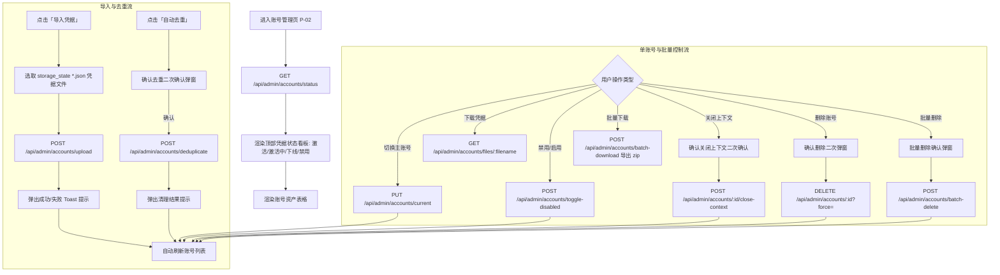
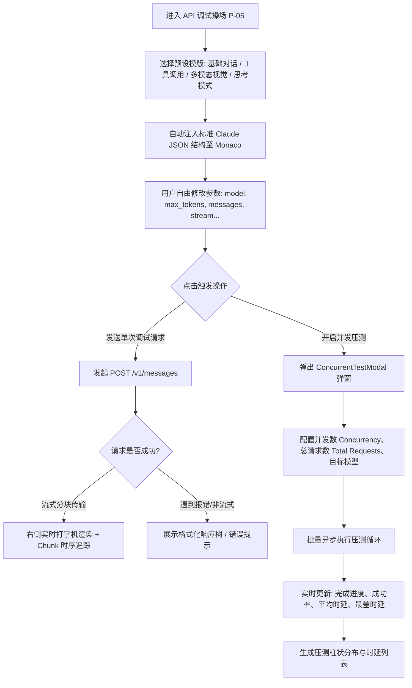

# 用户操作旅程与行为流向图 (User Flow)

本文件详细剖析系统的核心用户角色、典型操作场景、完整的端到端用户流转路径（Happy Path / Edge Cases）以及各节点的状态转换。

---

## 1. 用户角色与典型操作场景

| 用户角色 | 核心关注点 | 典型场景 (User Journeys) |
| :--- | :--- | :--- |
| **API 开发者 (Developer)** | 接口兼容性、调试效率、提示词效果 | 1. 在 Playground 编写 Claude Tool Use 请求并测试 Gemini 代理效果。<br>2. 请求失败后前往 Logs 查找刚才的请求，对比 Claude Request 与 Gemini Request 转换差异。<br>3. 一键复制 cURL 在本地命令行或终端进行隔离验证。 |
| **系统运维/SRE (Ops / SRE)** | 代理稳定性、并发负载、凭据健康度 | 1. 登录 Dashboard 观察实时 QPS 波动、平均响应时长及 4xx/5xx 错误分布。<br>2. 发现错误率上升后，在 Accounts 查看账号池状态，排查是否出现凭据过期或配额耗尽。<br>3. 打开 Terminal 实时跟踪 PM2 进程状态或检查宿主机网络环境。 |
| **翻译/评测人员 (Evaluator)** | 多模型翻译质量、耗时对比 | 1. 在 Translate 工作台贴入长文本技术规范。<br>2. 开启 Compare Mode，选取 2~3 个最新模型并行发起流式生成。<br>3. 实时比对双栏译文、首字延迟与生成速度 (Tokens/s)。 |

---

## 2. 核心业务流程图解

### 2.1 鉴权与进入系统流向 (Authentication & Session Guard)

```mermaid
flowchart TD
    Start([访问系统 URL]) --> CheckLocalKey{本地是否存在 adminKey?}
    CheckLocalKey -- 是 --> VerifyAPI[请求 GET /api/admin/status 校验凭据]
    CheckLocalKey -- 否 --> ShowLogin[渲染登录界面 P-00]
    
    VerifyAPI --> APIStatus{接口响应状态}
    APIStatus -- 200 OK --> SetAuthSuccess[标记已认证, 加载最后保留的 Tab / 路由]
    APIStatus -- 401 Unauthorized --> ShowAuthError[提示密钥错误, 留在登录界面]
    APIStatus -- 网络错误 --> ShowConnError[提示网络异常, 允许重试]
    
    ShowLogin --> UserInput[用户输入 Admin Key 并提交]
    UserInput --> VerifyAPI
    SetAuthSuccess --> MountMainApp[挂载主应用框架 (Sidebar + Header + View)]
```

---

### 2.2 账号凭据全生命周期管理流向 (Accounts Lifecycle Flow)



---

### 2.3 请求审计与故障排查流向 (Request Inspection & Debug Flow)

```mermaid
flowchart TD
    EnterLogs[进入请求日志页面 P-03] --> FetchTree[拉取时间树 GET /api/admin/logs]
    FetchTree --> AutoSelectTop[自动选中最新一条日志]
    AutoSelectTop --> FetchLogDetail[拉取该日志详细报文 /api/admin/logs/:d/:h/:f]
    
    subgraph 检索与筛选分支
        UserFilter[筛选操作: 日期下拉 / 小时下拉 / 状态码(2xx/4xx/5xx) / 文本搜索]
        UserFilter --> RequeryList[按条件重新筛选列表并在左侧高亮命中项]
    end

    subgraph 检查器模式交互
        DetailLoaded[详情数据载入完成] --> InspectorTabs{选择检查器模式}
        InspectorTabs -- Payload Tab --> ViewModeSelect{选择展示形态}
        ViewModeSelect -- 树形预览 (Preview) --> JsonTreeView[交互式 JsonTreeView: 默认展开1级, 支持节点复制]
        ViewModeSelect -- 原始 JSON (Raw) --> MonacoEditor[只读 Monaco Editor 语法高亮]
        
        InspectorTabs -- Response Tab --> StreamDetect{是否为流式响应?}
        StreamDetect -- 是 --> SsePreview[SseStreamPreview: 分块时序轴, 重新装配完整文本, 打字机重放]
        StreamDetect -- 否 --> NormalRes[展示普通 JSON / 错误堆栈]
        
        InspectorTabs -- Chat Tab --> ConversationView[ConversationView: 还原多轮对话, 气泡渲染, 思维链折叠, Tool Call 卡片]
    end

    subgraph 快速复现外溢
        CopyCurl[点击「复制 Claude cURL」或「复制 Gemini cURL」] --> Clipboard[写入剪贴板]
        GoTerminal[切换到网页终端 P-04] --> PasteAndRun[粘贴并即时运行复现]
    end
```

---

### 2.4 API 操场调试与压测流向 (Playground & Stress Test Flow)



---

### 2.5 翻译对比多栏流向 (Translate Comparison Flow)

```mermaid
flowchart TD
    EnterTranslate[进入翻译工作台 P-06] --> InputSource[在左侧输入需要翻译的技术文档/文本]
    InputSource --> AutoDetect[客户端正则秒级识别语种 (中/英/日/法/德/等)]
    
    AutoDetect --> ConfigOptions[配置: 目标语言 / 翻译风格 (标准/技术/学术/润色)]
    ConfigOptions --> ModeToggle{单模型 vs 多模型对比?}
    
    ModeToggle -- 单模型模式 --> PickOne[选择单个模型: 如 gemini-2.5-flash]
    ModeToggle -- 对比模式 --> PickMultiple[多选 2~3 个对比模型: 如 flash vs pro vs lite]
    
    PickOne & PickMultiple --> ClickTranslate[点击「立即翻译」]
    ClickTranslate --> FanOutCalls[并行向 /v1/messages 发起流式翻译请求 (携带特制 System Prompt)]
    FanOutCalls --> StreamPerColumn[各栏独立接收 SSE 流, 实时 Markdown 渲染, 统计已耗时、生成 Token 数及 Tokens/s]
    StreamPerColumn --> RenderCompareCard[卡片并列展示, 支持单栏停止、全部重试、一键复制译文]
```
